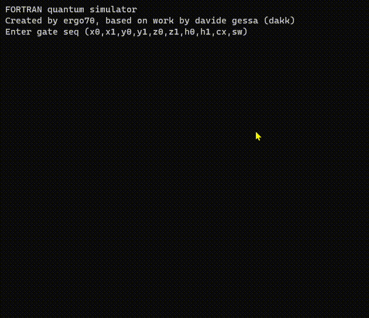

# QF - Quantum Simulator for FORTRAN

QF is an experimental quantum computing simulator written in pure FORTRAN.
You need a FORTRAN 2003 compiler to build this simulator.
This is a port of qc64 project by Davide Gessa (dakk) https://github.com/dakk/qc64

## Features

-    Simulate operations of various quantum gates including Pauli-X, Pauli-Y, Pauli-Z, Hadamard, CNOT, and SWAP on a two-qubit system.
-    Written in ~300 lines of FORTRAN code.
-    Uses OpenMP parallelization of the main loop (doing the "shots") on multicore systems, if available.

## How it works

Starting from the initial state |00>, the simulator can apply various quantum gates to manipulate the state of the two-qubit system. This allows for the simulation of various quantum computing concepts right on your digital computer!

## License

QF is released under MIT License.
