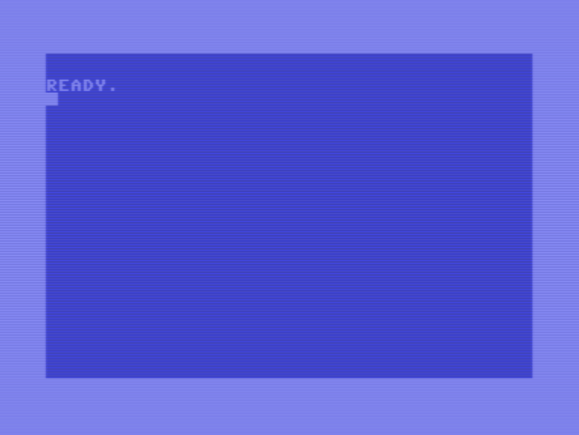

# QC64 - Quantum Simulator for the Commodore 64

QC64 is an experimental quantum computing simulator for the Commodore 64, written in pure BASIC.

## Features

-    Simulate operations of various quantum gates including Pauli-X, Pauli-Y, Pauli-Z, Hadamard, CNOT, and SWAP on a two-qubit system.
-    Written in less than 200 lines of BASIC code.

## How it works

Starting from the initial state |00>, the simulator can apply various quantum gates to manipulate the state of the two-qubit system. This allows for the simulation of various quantum computing concepts right on your Commodore 64!

## Contributions

Contributions to QC64 are welcome! Feel free to create a pull request or open an issue if you have ideas for improvements or spot any bugs.

## License

QC64 is released under MIT License.
Let's Rekindle the Magic of Vintage Computing!
